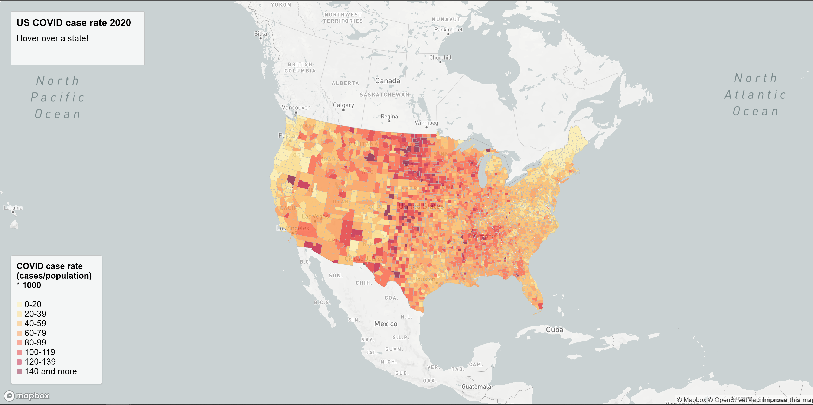

# Visualizations of COVID-19 in 2020
---
### Introduction 
In this assignment, I will be creating visualizations for the state of COVID-19 in the United States in 2020 using MapBox API. Specifically, I will be visualizing COVID-19 case rate for each county through a choropleth map and COVID-19 case counts for each county through a proportional symbol map. Through these visualizations, the spread and burden of disease can be observed. 

### Maps

[Link to COVID cases map](https://eaks2.github.io/2020_Covid_geog458/map1.html)

[Link to COVID rates map](https://eaks2.github.io/2020_Covid_geog458/map2.html)

The web maps themselves were built using various languages including HTML for the backbone of the webpage, CSS in order to style the HTML, and Javascript in order to use the MapBox API to load in data and create the map which fills the content of the web page. Furthermore, the MapBox API is also used to add an interactive element to the map which allows users to hover over or click on areas of interest in order to get more information regarding the area. 

### Data Source : 
[NYT - COVID cases](https://github.com/nytimes/covid-19-data/blob/43d32dde2f87bd4dafbb7d23f5d9e878124018b8/live/us-counties.csv)
[US Census Bureau - County Boundary](https://www.census.gov/geographies/mapping-files/time-series/geo/carto-boundary-file.html)
[US Census Bureau - Population Data](https://data.census.gov/cedsci/table?g=0100000US%24050000&d=ACS%205-Year%20Estimates%20Data%20Profiles&tid=ACSDP5Y2018.DP05&hidePreview=true)

